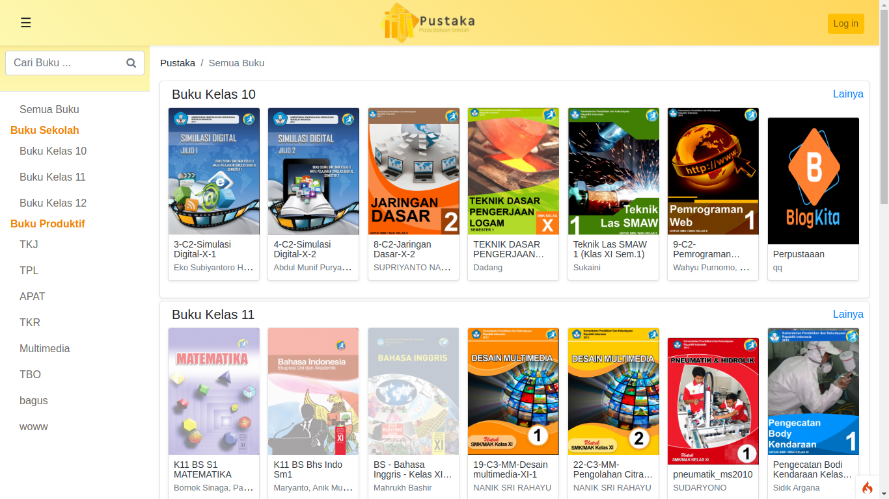

# Pustaka Elektronik Sekolah (PES)


Pustaka Elektronik Sekolah adalah aplikasi berbasis web yang memberikan layanan literasi berupa E-book. Biasanya siswa sekolah malu/malas meminjam buku di pepustakaan, PES hadir untuk mempermudah siswa sekolah membaca dimanapun dan kapanpun, cukup dengan gadget siswa bisa mencari buku dia ingin. 

## Fiture
* Ringan
* User friendly
* Mudah mencari buku (penyimpanan rapih)
* Unduh buku
* PDF reader (halaman membaca buku)
* Memberi rating
* Lederboard 
* Pencarian buku
* Pencatatan waktu baca
* Pencatatan buku apa saja yang dibaca
* Memberikan ulasan ***(Commming Soon)***
* Menyimpan buku ***(Comming Soon)***
* Layanan rest API

#### Admin side
* Menambah, mengedit, dan menghapus buku
* Mengelola Menu kategori buku (Dynamic Category)
* Monitoring aktifitas pengguna membaca buku
* Memberikan rekomendasi buku ***(Comming Soon)***
* Penugasan membaca buku ***(Comming Soon)***

## Installation & Setup

#### Server Requirements

* PHP version 7.3+
* Composser (download file vendor)

#### Download file
Kamu bisa mendownload file dengan mendownload zip lalu extrak filenya ke repo server atau dengan git
```
cd /server/path
git clone https://github.com/Dav0x0/Pustaka-sekolah.git
```

#### Setup
File ***.env***
````
#--------------------------------------------------------------------
# ENVIRONMENT
#--------------------------------------------------------------------
CI_ENVIRONMENT = production

#--------------------------------------------------------------------
# APP
#--------------------------------------------------------------------
app.baseURL = 'http://yourdomain.com/'

#--------------------------------------------------------------------
# DATABASE
#--------------------------------------------------------------------
database.default.hostname = 127.0.0.1
database.default.database = nama_database
database.default.username = user_database
database.default.password = pass_database
````
Untuk **Linux** beri permission pada folder 
```
/public/book
/public/img/book
/public/img/logo
/writable
```

## Penting

Aplikasi ini berjalan bergantung pada aplikasi [AppsSchool](https://github.com/Dav0x0/Apps-School) untuk mengambil data siswa dan data sekolah lainnya dan layanan loginnya juga
